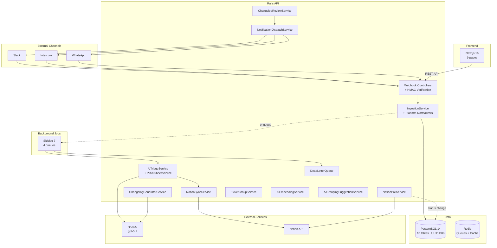
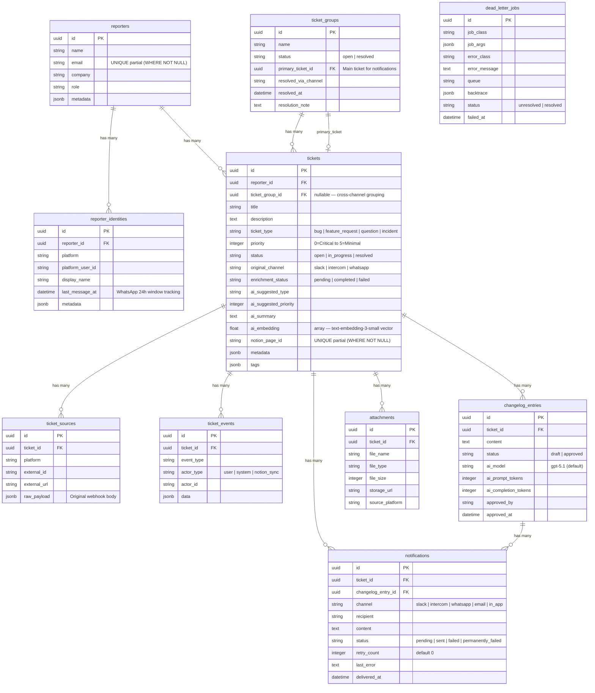
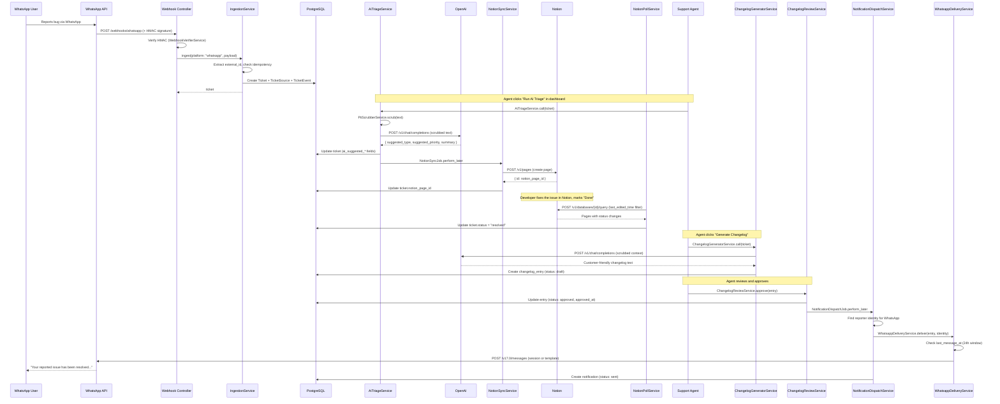
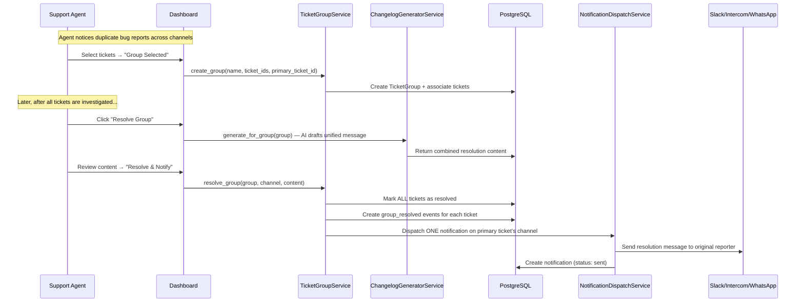

# Feedback Hub

**Unified feedback intake, AI-powered triage, and automated resolution notifications — across Slack, Intercom, and WhatsApp.**

| Layer | Stack |
|-------|-------|
| Backend | Ruby 3.3.6 · Rails 8.1 (API-only) · PostgreSQL 14 · Sidekiq 7 · Redis |
| Frontend | Next.js 16 · React 19 · Tailwind 4 · Recharts |
| AI | OpenAI gpt-5.1 (default), selectable: gpt-5.1 · gpt-4.1 · gpt-4o-mini · o3-mini |
| Integrations | Notion API · Slack API · Intercom API · WhatsApp Business API |

**Test coverage:** 351 backend specs (RSpec) + 42 frontend tests (Jest/React Testing Library)

---

## Table of Contents

1. [Quick Start](#1-quick-start)
2. [Architecture Overview](#2-architecture-overview)
3. [Data Model & ERD](#3-data-model--erd)
4. [Ingestion Layer](#4-ingestion-layer)
5. [AI Enrichment Pipeline](#5-ai-enrichment-pipeline)
6. [Notion Two-Way Sync](#6-notion-two-way-sync)
7. [Changelog Generation & Resolution](#7-changelog-generation--resolution)
8. [Notifications & Closing the Loop](#8-notifications--closing-the-loop)
9. [Retry Limits & Rate Protection](#9-retry-limits--rate-protection)
10. [Cross-Channel Ticket Grouping](#10-cross-channel-ticket-grouping)
11. [AI Embedding & Grouping Suggestions](#11-ai-embedding--grouping-suggestions)
12. [Observability](#12-observability)
13. [Security](#13-security)
14. [Sequence Diagrams](#14-sequence-diagrams)
15. [Edge Cases & Risk Analysis](#15-edge-cases--risk-analysis)
16. [API Reference](#16-api-reference)
17. [Frontend Pages](#17-frontend-pages)
18. [Testing](#18-testing)
19. [Trade-offs & Alternatives](#19-trade-offs--alternatives)
20. [AWS Deployment Readiness](#20-aws-deployment-readiness)

---

## 1. Quick Start

### Prerequisites

- Ruby 3.3.6 (via rbenv / RubyInstaller)
- PostgreSQL 14
- Redis
- Node.js 22+

### Setup — macOS

```bash
# 1. Install dependencies (Homebrew)
brew install rbenv postgresql@14 redis node

# 2. Start services
brew services start redis
brew services start postgresql@14

# 3. Backend — install, create DB, migrate
cd hub
rbenv install 3.3.6 && rbenv local 3.3.6
bundle install
bin/rails db:create db:migrate
bin/rails server -p 3000

# 4. Sidekiq (new terminal)
cd hub
bundle exec sidekiq -C config/sidekiq.yml

# 5. Simulator — generates realistic payloads every ~3 min (optional)
cd hub
bin/rails simulator:start

# 6. Frontend (new terminal)
cd frontend
npm install
npm run dev   # → http://localhost:3001
```

### Setup — Linux (Ubuntu/Debian)

```bash
# 1. Install system dependencies
sudo apt update && sudo apt install -y build-essential libpq-dev libssl-dev \
  libyaml-dev zlib1g-dev libreadline-dev postgresql postgresql-contrib redis-server

# 2. Install rbenv + Ruby
curl -fsSL https://github.com/rbenv/rbenv-installer/raw/HEAD/bin/rbenv-installer | bash
echo 'eval "$(rbenv init -)"' >> ~/.bashrc && source ~/.bashrc
rbenv install 3.3.6 && rbenv global 3.3.6

# 3. Install Node.js 22 (via NodeSource)
curl -fsSL https://deb.nodesource.com/setup_22.x | sudo -E bash -
sudo apt install -y nodejs

# 4. Start services
sudo systemctl start redis-server
sudo systemctl start postgresql

# 5. Create PostgreSQL user (if needed)
sudo -u postgres createuser -s $(whoami)

# 6. Backend
cd hub
bundle install
bin/rails db:create db:migrate
bin/rails server -p 3000

# 7. Sidekiq (new terminal)
cd hub
bundle exec sidekiq -C config/sidekiq.yml

# 8. Simulator (optional, new terminal)
cd hub
bin/rails simulator:start

# 9. Frontend (new terminal)
cd frontend
npm install
npm run dev   # → http://localhost:3001
```

### Setup — Windows

> **Recommended:** Use WSL 2 (Windows Subsystem for Linux) with Ubuntu and follow the Linux instructions above. This is the most reliable path for Ruby + Rails development on Windows.

**Native Windows (without WSL):**

```powershell
# 1. Install Ruby via RubyInstaller (https://rubyinstaller.org/)
#    Download Ruby+Devkit 3.3.6 and run the installer (select MSYS2 toolchain)

# 2. Install PostgreSQL 14 from https://www.postgresql.org/download/windows/
# 3. Install Redis via Memurai (https://www.memurai.com/) or Docker Desktop

# 4. Install Node.js 22 from https://nodejs.org/

# 5. Backend (Command Prompt or PowerShell)
cd hub
bundle install
rails db:create db:migrate
rails server -p 3000

# 6. Sidekiq (new terminal)
cd hub
bundle exec sidekiq -C config/sidekiq.yml

# 7. Frontend (new terminal)
cd frontend
npm install
npm run dev
```

> **Note:** Some gems with native extensions may require additional configuration on native Windows. WSL 2 avoids these issues entirely.

| Service | Port |
|---------|------|
| Rails API | 3000 |
| Next.js Dashboard | 3001 |
| Redis | 6379 |

### Environment Variables

| Variable | Purpose |
|----------|---------|
| `OPENAI_API_KEY` | AI triage + changelog generation |
| `NOTION_API_KEY` | Notion two-way sync |
| `NOTION_DATABASE_ID` | Target Notion database |
| `SLACK_SIGNING_SECRET` | HMAC verification for Slack webhooks |
| `INTERCOM_WEBHOOK_SECRET` | HMAC verification for Intercom webhooks |
| `WHATSAPP_WEBHOOK_SECRET` | HMAC verification for WhatsApp webhooks |
| `SLACK_BOT_TOKEN` | Notification delivery to Slack |
| `INTERCOM_API_TOKEN` | Notification delivery to Intercom |
| `WHATSAPP_API_TOKEN` | Notification delivery to WhatsApp |

---

## 2. Architecture Overview



**Flow summary:** Feedback enters via platform webhooks → normalized into canonical Tickets → AI triages (type, priority, summary) → synced to Notion for dev tracking → Notion poll detects "Done" → human triggers changelog generation → human approves → notification sent back to original reporter on their channel.

---

## 3. Data Model & ERD

### 3.1 Entity-Relationship Diagram



### 3.2 Key Design Decisions

| Decision | Rationale |
|----------|-----------|
| **UUID primary keys** | Avoids sequential ID leakage in a multi-tenant/webhook context. Uses PostgreSQL's `pgcrypto` extension (`gen_random_uuid()`). |
| **`UNIQUE(platform, external_id)` on `ticket_sources`** | Core idempotency mechanism — duplicate webhooks are safely ignored at the DB level. |
| **`UNIQUE` partial index on `notion_page_id`** | Only enforced `WHERE notion_page_id IS NOT NULL` — tickets that haven't synced yet don't conflict. |
| **`UNIQUE` partial index on `reporters.email`** | Cross-channel reporter resolution uses email as the identity bridge (where available). |
| **JSONB for `raw_payload`** | Stores the complete original webhook body for debugging without prescribing a schema. |
| **JSONB for `metadata`** | Extensible key-value store on reporters, identities, and tickets for platform-specific data. |
| **Separate `ticket_events` table** | Append-only audit log. Every state change is recorded (created, ai_triaged, synced_to_notion, status_changed, changelog_drafted/approved, notification_sent/failed, ticket_grouped/ungrouped, group_resolved, pii_redacted). |
| **`enrichment_status` on tickets** | Tracks AI pipeline state independently — `pending` → `completed` / `failed`. Allows retry without losing the ticket. |
| **`last_message_at` on `reporter_identities`** | Enables WhatsApp 24h session window calculation. |

### 3.3 Index Strategy

```
tickets         → status, priority, original_channel, ticket_type, enrichment_status,
                  created_at, reporter_id, ticket_group_id, notion_page_id (unique partial)
ticket_groups   → status, primary_ticket_id
ticket_sources  → (platform, external_id) unique composite
ticket_events   → ticket_id, event_type, created_at
changelog_entries → ticket_id, status
notifications   → ticket_id, changelog_entry_id, status
reporter_identities → (platform, platform_user_id) unique composite, reporter_id
reporters       → email (unique partial)
dead_letter_jobs → status, job_class, failed_at
attachments     → ticket_id
```

All tables have UUID primary keys with `gen_random_uuid()` defaults. Foreign keys are enforced at the database level for referential integrity.

---

## 4. Ingestion Layer

### 4.1 Webhook Endpoints

Three platform-specific webhook endpoints receive external payloads:

| Endpoint | Platform | External ID Source | HMAC Header |
|----------|----------|--------------------|-------------|
| `POST /webhooks/slack` | Slack | `payload.issue_id` or `trigger_id` | `X-Slack-Signature` (`v0:timestamp:body` + SHA256) |
| `POST /webhooks/intercom` | Intercom | `data.item.id` | `X-Hub-Signature` (SHA256) |
| `POST /webhooks/whatsapp` | WhatsApp | `entry[0].changes[0].value.messages[0].id` | `X-Hub-Signature-256` (SHA256) |

Additionally, `POST /api/tickets` supports manual creation from the backoffice.

### 4.2 Normalization Pipeline

```
Webhook → Controller (HMAC verify) → IngestionService.ingest
                                          │
                                          ├─ Extract external_id
                                          ├─ Idempotency check (TicketSource lookup)
                                          ├─ Select normalizer (Slack/Intercom/WhatsApp)
                                          ├─ Resolve reporter identity (email-first, fallback to platform ID)
                                          ├─ Create Ticket + TicketSource + TicketEvent
                                          └─ Return ticket
```

Each platform normalizer (`SlackNormalizer`, `IntercomNormalizer`, `WhatsappNormalizer`) handles:
- Extracting title/description from platform-specific payload structure
- Priority inference from text (English + Spanish keywords)
- Ticket type inference from context
- Reporter identity resolution (see below)
- Storing the complete raw payload as JSONB for debugging

### 4.4 Cross-Channel Reporter Resolution

The `reporters.email` field (unique partial index) is the cross-channel identity bridge. Resolution in `BaseNormalizer.find_or_create_reporter`:

1. **If email is available** (e.g., Intercom provides user email) → `Reporter.find_or_initialize_by(email:)` — links the new platform identity to the existing reporter record
2. **If no email** (Slack user ID only, WhatsApp phone only) → falls back to `ReporterIdentity.find_by(platform, platform_user_id)` — matches within the same platform only
3. A `ReporterIdentity` is always created/found for the `(platform, platform_user_id)` pair and associated with the reporter

**Limitation:** If the same person reports via two channels that don't provide email (e.g., Slack + WhatsApp), they'll get two separate `Reporter` records. The `display_name` on `reporter_identities` is informational only — name matching is too unreliable for automatic deduplication. Cross-channel merge would require either AI-based similarity matching on recent tickets (designed but not implemented) or a manual merge UI.

### 4.3 Idempotency

The system guarantees exactly-once processing per webhook:

1. **Extract** the platform-specific external ID from the payload
2. **Query** `ticket_sources` for `(platform, external_id)`
3. **If found** → return the existing ticket (no-op)
4. **If not found** → normalize and create ticket
5. **DB constraint** → `UNIQUE(platform, external_id)` on `ticket_sources` provides a safety net even under race conditions

---

## 5. AI Enrichment Pipeline

### 5.1 AiTriageService

When triggered (user-initiated via the dashboard), the triage pipeline:

1. **PII Scrubbing** — `PiiScrubberService` strips emails and phone numbers via regex before any data reaches OpenAI
2. **OpenAI Request** — Sends the scrubbed ticket text to the configured model (default `gpt-5.1`) with a structured prompt requesting JSON: `{ suggested_type, suggested_priority, summary }`
3. **Store Suggestions** — Saves AI output to `ai_suggested_type`, `ai_suggested_priority`, `ai_summary` fields
4. **Human-in-the-Loop** — AI fields are stored separately from confirmed fields (`ticket_type`, `priority`, `title`). A support agent reviews and can accept, modify, or reject AI suggestions before they affect the ticket
5. **Notion Sync** — On successful triage, `NotionSyncJob` is enqueued to push the ticket to Notion

### 5.2 PiiScrubberService

Detects and redacts 4 categories of sensitive data before any OpenAI API call:

| Type | Pattern | Replacement |
|------|---------|-------------|
| Email | `user@domain.com` | `[EMAIL]` |
| Phone | `+56 9 8765 4321`, `555-123-4567` | `[PHONE]` |
| Password | `password: secret`, `pwd=hunter2` | `[PASSWORD]` |
| SSN | `123-45-6789`, `123 45 6789` | `[SSN]` |

- Returns both the scrubbed text and a redaction log (type + original value)
- Applied in `AiTriageService`, `ChangelogGeneratorService`, and `TicketTypeInferenceService`
- Original data is preserved in the database; only the AI sees scrubbed versions

### 5.3 AI Prompt Preview

Before generating a changelog, the agent can preview what will be sent to OpenAI:

1. Click **"Generate with AI"** on a resolved ticket
2. The system fetches `GET /api/tickets/:id/preview_changelog` — returns the original text, scrubbed text, and a list of redactions
3. The agent sees an **AI Prompt Preview** panel:
   - Amber box listing each redacted item with the original value (e.g., `[EMAIL]` ~~maria.garcia@company.com~~)
   - The exact scrubbed text that will be sent to OpenAI
4. Click **"Confirm & Generate"** to proceed, or **"Cancel"** to back out

This gives full transparency into what data reaches external AI services.

### 5.3 Rate Limit Handling

- OpenAI `429` responses trigger a cooldown stored in Redis cache (`openai:rate_limited`)
- Cooldown duration respects the `Retry-After` header (minimum 60 seconds)
- Requests during cooldown raise `AiApiError` immediately (no wasted API calls)
- Up to 2 automatic retries per request

### 5.4 Fallback Behavior

If OpenAI is unavailable or the API key is not configured:
- The ticket is saved with `enrichment_status: pending`
- No data is lost — the ticket exists and is visible in the dashboard
- Triage can be retried later via the dashboard

---

## 6. Notion Two-Way Sync

### 6.1 Push: Hub → Notion (`NotionSyncService`)

When a ticket is triaged, `NotionSyncJob` pushes it to a Notion database:

| Ticket Field | Notion Property | Type |
|-------------|----------------|------|
| `title` | Title | title |
| `priority` (0-5) | Priority | select (Critical/High/Medium/Normal/Low/Minimal) |
| `ticket_type` | Type | select |
| `status` | Status | select |
| `original_channel` | Channel | select |

- **Create vs Update**: If `notion_page_id` is null → create page. If present → update existing page.
- Stores `notion_page_id` on the ticket for bidirectional linking.
- Records a `synced_to_notion` event in `ticket_events`.

### 6.2 Pull: Notion → Hub (`NotionPollService`)

A `NotionPollSchedulerJob` self-reschedules every 2 minutes:

1. Query Notion database with `last_edited_time > last_poll_timestamp` filter
2. For each modified page, look up the ticket by `notion_page_id`
3. Map Notion status → Hub status: `Done → resolved`, `In Progress → in_progress`, `Open → open`
4. If status changed, update ticket and record a `status_changed` event
5. Store `last_poll_timestamp` in Redis cache for incremental polling

### 6.3 Why Polling (Not Webhooks)

| Factor | Assessment |
|--------|-----------|
| **Notion webhook support** | Notion's webhook support is limited — no granular page-level change events, only database-level triggers with limited filtering |
| **Rate limits** | Notion allows 3 requests/second. Polling every 2 minutes uses ~3 requests/poll — well within limits |
| **Incremental cursor** | `last_edited_time` filter ensures we only process changes since last poll — no full-scan needed |
| **Simplicity** | No webhook registration, no public endpoint exposure, no retry infrastructure for incoming webhooks |
| **Conflict resolution** | Notion status is the source of truth for execution state (developers work in Notion). Polling naturally respects this — Hub reads from Notion, never overwrites Notion status |

### 6.4 Rate Limit Handling

Both `NotionSyncService` and `NotionPollService` handle `429` responses:
- Parse `Retry-After` header
- Raise `RateLimitError` with `retry_after` value
- Jobs use `retry_on` with polynomial backoff (max 3 attempts) — see [Section 9](#9-retry-limits--rate-protection)

---

## 7. Changelog Generation & Resolution

### 7.1 The "Release Valve" Concept

When a ticket is resolved (detected via Notion poll or manual action), the system does **not** automatically generate and send notifications. Instead:

1. **Human triggers** — A support agent clicks "Generate Changelog" in the dashboard
2. **AI drafts** — `ChangelogGeneratorService` calls OpenAI to produce a customer-friendly message (2-3 sentences, no jargon)
3. **Human reviews** — The agent reads the draft, can edit the text
4. **Human approves** — Only "Approve & Send" triggers notification dispatch

This mandatory human step is the primary defense against AI hallucinations reaching customers. There is no reject action — agents can simply edit the draft or regenerate it.

### 7.2 ChangelogGeneratorService

- Validates ticket is in `resolved` status
- Idempotent: returns existing draft if one exists (no duplicate generation)
- Scrubs PII before sending to OpenAI
- Tracks token usage (`ai_prompt_tokens`, `ai_completion_tokens`) per entry
- Records `changelog_drafted` event
- **AI model selector** — Agents can choose between `gpt-5.1` (default), `gpt-4.1`, `gpt-4o-mini`, and `o3-mini` before generating

### 7.4 Structured Changelog Format

All changelogs (AI-generated and manual) follow a mandatory 3-section structure:

```
**What happened:**
(Describe the problem in simple, non-technical terms — 1-2 sentences)

**How we fixed it:**
(Explain the resolution focusing on the outcome — 1-2 sentences)

**Going forward:**
(Brief reassurance and what to expect — 1 sentence)
```

- AI prompts enforce these exact section headers
- Manual changelog forms pre-fill with the template
- Both individual tickets and group resolutions use the same structure

### 7.3 ChangelogReviewService

| Action | Guard | Side Effect |
|--------|-------|-------------|
| `approve(entry, approved_by:)` | Must be `draft` | Sets `approved_at`, enqueues `NotificationDispatchJob` |
| `update_draft(entry, new_content:)` | Must be `draft` | Updates content (human editing) |

Both actions enforce a status guard — only `draft` entries can be acted on. This prevents double-dispatch or editing already-approved changelogs.

---

## 8. Notifications & Closing the Loop

### 8.1 NotificationDispatchService

After a changelog entry is approved, `NotificationDispatchJob` triggers `NotificationDispatchService`:

1. **Validate** — Entry must be in `approved` status
2. **Find recipient** — Look up the reporter's identity for the ticket's original channel
3. **Deliver** — Send via the platform API (Slack, Intercom, WhatsApp, or mock for dev)
4. **Record** — Create `notification_sent` or `notification_failed` event

### 8.2 Platform Delivery

| Channel | API | Payload |
|---------|-----|---------|
| Slack | `chat.postMessage` | `{ channel, text }` |
| Intercom | Messages API | `{ message_type: "inapp", body, from, to }` |
| WhatsApp | Graph API v17.0 | Session or template message (see below) |
| Email / In-App | Mock (no external call) | Logged for manual follow-up |

### 8.3 WhatsApp 24h Session Window

WhatsApp Business API restricts free-form messaging to a 24-hour window after the user's last message. `WhatsappDeliveryService` handles this:

```
┌─────────────────────────────────────────────────┐
│         WhatsApp Delivery Decision Tree          │
├─────────────────────────────────────────────────┤
│                                                  │
│  reporter_identity.last_message_at              │
│       │                                          │
│       ├─ < 24h ago → SESSION MESSAGE             │
│       │   (free-form text, full content)         │
│       │                                          │
│       ├─ > 24h ago → TEMPLATE MESSAGE            │
│       │   (pre-approved "issue_resolved"          │
│       │    template, truncated to 200 chars)     │
│       │                                          │
│       └─ Template fails → channel_restricted     │
│           (surfaced in dashboard for             │
│            manual follow-up)                     │
│                                                  │
└─────────────────────────────────────────────────┘
```

- `last_message_at` is tracked on `reporter_identities` and updated when WhatsApp webhooks arrive
- Session messages use `type: "text"` (free-form)
- Template messages use `type: "template"` with the pre-approved `issue_resolved` template
- If the template call fails (e.g., template not configured), the notification gets `channel_restricted` status

### 8.4 Retry with Backoff

Failed notifications are retried via `NotificationRetryJob`:
- Each failure increments `retry_count` and stores the error in `last_error`
- **Max 5 retries** — `NotificationRetryJob` enforces `MAX_RETRIES = 5`. After exceeding this limit, the notification is marked `permanently_failed` with a final event recorded
- Notifications in `failed` status (under the retry limit) are automatically re-enqueued
- `permanently_failed` notifications are surfaced in the dashboard for manual investigation

---

## 9. Retry Limits & Rate Protection

### 9.1 Notification Retry Limits

Failed notifications are retried by `NotificationRetryJob` with a hard cap:

| Mechanism | Limit | Outcome |
|-----------|-------|---------|
| `NotificationRetryJob` | `MAX_RETRIES = 5` | Exceeding → `permanently_failed` status + event logged |
| Each retry attempt | Increments `retry_count`, stores `last_error` | Dashboard shows current retry state |
| `permanently_failed` | Terminal state | Surfaced in dashboard for manual investigation |

This prevents unbounded retry loops when a platform API is persistently down.

### 9.2 Notion API Rate Limits

Both Notion jobs use ActiveJob `retry_on` with polynomial backoff:

| Job | Error | Attempts | Backoff |
|-----|-------|----------|---------|
| `NotionSyncJob` | `RateLimitError` | 3 | Polynomial (increasing delay) |
| `NotionSyncJob` | `ApiError` | 3 | 30 seconds fixed |
| `NotionPollJob` | `RateLimitError` | 3 | Polynomial (increasing delay) |

After exhausting retry attempts, the error propagates to Sidekiq's dead set and lands in the dead letter queue for manual inspection.

### 9.3 OpenAI Rate Limits

- `429` responses trigger a cooldown stored in Redis cache (`openai:rate_limited`)
- Cooldown duration respects the `Retry-After` header (minimum 60 seconds)
- Requests during cooldown raise `AiApiError` immediately (no wasted API calls)

### 9.4 Mass-Resolution Spam Prevention

When multiple tickets are resolved simultaneously (e.g., a Notion task marked "Done" affecting many linked issues), the system prevents notification floods through **ticket grouping**:

1. Support agents group related tickets via `TicketGroupService`
2. Group resolution sends **one notification** on the primary ticket's channel (not one per ticket)
3. The human-in-the-loop approval step on changelogs acts as a natural throttle — no notification dispatches without explicit human approval

---

## 10. Cross-Channel Ticket Grouping

### 10.1 The Problem

The same bug is often reported through multiple channels — a user complains on Slack, another opens an Intercom chat, a third sends a WhatsApp message. Without grouping, each becomes a separate ticket with a separate Notion page, separate changelog, and separate notification. Resolution is fragmented.

### 10.2 TicketGroupService

`TicketGroupService` manages the lifecycle of ticket groups:

| Action | Method | Rules |
|--------|--------|-------|
| **Create group** | `create_group(name:, ticket_ids:, primary_ticket_id:)` | Minimum 2 tickets. Primary must be in the group. Tickets can't already belong to another group. |
| **Add tickets** | `add_tickets(group, ticket_ids)` | Same uniqueness guard — no ticket in two groups. |
| **Remove ticket** | `remove_ticket(group, ticket_id)` | Creates a `ticket_ungrouped` event. If fewer than 2 remain, the group dissolves automatically (all remaining tickets get `ticket_ungrouped` events with `reason: group_dissolved`). If the primary ticket is removed, a new primary is assigned. |
| **Resolve group** | `resolve_group(group:, channel:, resolution_note:, content:)` | Resolves all tickets, sends one notification on the primary ticket's channel, creates `group_resolved` events. |

### 10.3 Group Resolution Flow

When a group is resolved:

1. All tickets in the group are marked `resolved`
2. Approved changelog entries from all tickets are aggregated into one notification
3. The notification is sent only on the **primary ticket's** channel (avoids duplicate messages)
4. `group_resolved` events are created for every ticket in the group
5. The group status is set to `resolved` with a timestamp and resolution note

### 10.4 Dashboard Integration

- **Ticket Dashboard (`/`)** — Multi-select tickets with checkboxes → floating "Group Selected" bar → modal to name the group and pick a primary ticket
- **Ticket Groups Page (`/ticket-groups`)** — Lists all groups with status filter (open/resolved), expandable ticket cards, resolve button with content generation
- **Ticket Detail (`/tickets/[id]`)** — Shows group membership, "Add to Group" picker, "Remove from group" button

### 10.5 AI Content for Groups

When resolving a group, the agent can:
- **Generate with AI** — `ChangelogGeneratorService.generate_for_group(group)` sends all ticket titles/descriptions to OpenAI in one prompt, producing a unified resolution message
- **Write manually** — Skip AI entirely and type the resolution content

---

## 11. AI Embedding & Grouping Suggestions

### 11.1 AiEmbeddingService

Every ticket can be embedded into a vector representation using OpenAI's `text-embedding-3-small` model:

- **Cost-efficient:** ~$0.002 per 1,000 tickets — the model converts text into numerical vectors that are cheaper and faster to compare than full LLM calls
- **Stored on the ticket:** The `ai_embedding` column (float array) on the `tickets` table holds the vector
- **Idempotent:** If `ai_embedding` is already populated, the service returns it without calling OpenAI
- **PII scrubbed:** Text is run through `PiiScrubberService` before embedding

### 11.2 AiGroupingSuggestionService

Uses AI to analyze ungrouped tickets and suggest which ones should be grouped together:

1. Fetches ungrouped tickets within a configurable time window (default: last 30 minutes)
2. Scrubs PII from all ticket text before sending to OpenAI
3. Sends ticket summaries to the configured grouping model with a structured prompt
4. Returns suggestions: each with a group name, reason, and list of ticket IDs
5. Also returns per-ticket redaction data so the frontend can show which PII types were scrubbed

**Endpoint:** `POST /api/ticket_groups/suggest` with params: `limit`, `order`, `start_time`, `end_time`

### 11.3 AI Suggestions Page (`/ticket-groups/suggestions`)

A dedicated frontend page for AI-powered grouping:

- **Filter modal** — Configure ticket count, ordering, and time window (advanced: start/end time pickers)
- **Suggestions panel** — Each suggestion shows the group name, reason, and member tickets with inline channel badges, priority badges, and PII shield icons (tooltip on hover)
- **Actions** — "Create Group" (all ungrouped), "Add to Group" (some already grouped), "View in Group" (all already grouped), or "Dismiss"
- **Persistence** — Suggestions are saved to `localStorage` so they survive page navigations

### 11.4 Incident Simulation

`POST /api/ticket_groups/simulate_incident` generates 8 related tickets across Slack, Intercom, and WhatsApp channels to test the full grouping pipeline. All simulation logic is centralized in `IncidentSimulatorJob`.

---

## 12. Observability

### 12.1 StructuredLogger

JSON-structured logging with context propagation:

```json
{
  "timestamp": "2026-02-11T14:30:00.123-03:00",
  "level": "info",
  "message": "Ticket ingested",
  "service": "ingestion",
  "channel": "slack",
  "ticket_id": "abc-123",
  "duration_ms": 45
}
```

- **`with_context`** — Creates a scoped logger that automatically includes context fields (service name, channel, job ID) in every log entry
- **`measure`** — Times a block and logs duration; automatically logs errors with timing on exception
- **Singleton** — `StructuredLogger.instance` provides a shared instance

### 12.2 JobLogging Concern

Included in `ApplicationJob` — every Sidekiq job automatically gets:

- **Start log** — Job name, ID, queue, arguments
- **Complete log** — Duration in milliseconds
- **Error log** — Error class, message, duration
- **Force-fail check** — Reads from `ForceFailStore` (Redis) to intentionally fail jobs for DLQ testing

### 12.3 Dead Letter Queue

When a Sidekiq job exhausts all retries:

1. **Sidekiq death handler** → enqueues `DeadLetterHandlerJob`
2. **`DeadLetterHandlerJob`** → creates a `DeadLetterJob` record with full context (class, args, error, backtrace)
3. **Dashboard** → `/dead-letters` page shows unresolved failures
4. **Actions** — Resolve (acknowledge), Retry (re-enqueue the original job)

### 12.4 ForceFailStore

Redis-backed toggle for testing the dead letter queue in development:

- `POST /api/dead_letter_jobs/force_fail` — Sets a key to force-fail the next execution of a specified job class
- The `JobLogging` concern checks the key before `yield` and raises `ForceFailError` if set
- The key is single-use (deleted after one failure)

---

## 13. Security

### 13.1 HMAC Webhook Verification

All three webhook endpoints verify payload authenticity using `WebhookVerifierService`:

| Platform | Algorithm | Signature Format |
|----------|-----------|-----------------|
| Slack | SHA256 | `v0=` + HMAC(`v0:timestamp:body`) with 5-minute timestamp tolerance |
| Intercom | SHA256 | HMAC of raw body |
| WhatsApp | SHA256 | `sha256=` + HMAC of raw body |

All comparisons use `ActiveSupport::SecurityUtils.secure_compare` (timing-safe) to prevent timing attacks.

### 13.2 PII Scrubbing

- 4 PII types detected: emails, phone numbers, passwords, and SSNs
- All are stripped before any OpenAI API call via `PiiScrubberService`
- Applied in `AiTriageService`, `ChangelogGeneratorService`, and `TicketTypeInferenceService`
- Original data is preserved in the database; only the AI sees scrubbed versions
- A **preview endpoint** (`GET /api/tickets/:id/preview_changelog`) lets agents inspect the scrubbed prompt before generation

### 13.3 CORS

Configured for `localhost:3001` only (the Next.js dashboard).

---

## 14. Sequence Diagrams

### 14.1 Main Flow: WhatsApp Report → Resolution → Notification



### 14.2 Ticket Group Resolution Flow



---

## 15. Edge Cases & Risk Analysis

### 15.1 Spam & Mass Resolution (Challenge Section 10.1)

**Problem:** A mass-resolution event (e.g., sprint close resolving 50 tickets) could flood reporter channels with hundreds of notifications simultaneously.

**Solution:** Three layers of protection:
1. **Ticket grouping** — `TicketGroupService` groups duplicate/related tickets. Resolving a group sends **one notification** on the primary ticket's channel instead of one per ticket.
2. **Human-in-the-loop** — No notification dispatches without explicit changelog approval. The agent controls the pace of approvals.
3. **Retry limits** — `NotificationRetryJob` enforces `MAX_RETRIES = 5`. If a platform is overloaded, retries stop after 5 attempts and the notification is marked `permanently_failed` instead of retrying forever.

### 15.2 WhatsApp 24h Window (Challenge Section 10.2)

**Problem:** WhatsApp Business API only allows free-form messages within 24 hours of the user's last message. Notifications sent after this window require pre-approved templates.

**Solution:** `WhatsappDeliveryService` checks `reporter_identity.last_message_at`. If < 24h ago → session message (free-form text). If > 24h → pre-approved template message (`issue_resolved`). If no template is available or the call fails → `channel_restricted` status, surfaced in the dashboard for manual follow-up via another channel.

### 15.3 AI Hallucinations (Challenge Section 10.3)

**Problem:** AI-generated text could contain incorrect, misleading, or inappropriate content that reaches customers.

**Solution:** No AI-generated text ever reaches a customer without human approval. The `ChangelogReviewService` enforces: draft → human reviews/edits → approve → only then do notifications dispatch. The agent can edit the draft text before approving, or regenerate it entirely. This is the "Release Valve" — AI accelerates drafting, but a human always holds the send button.

### 15.4 Consistency & External Dependency Failures (Challenge Section 10.4)

**Problem:** External services (Notion, OpenAI, Slack, WhatsApp) can be temporarily unavailable. The system must not lose data.

**Solution:**
- **Idempotency** — Every webhook is idempotent via `UNIQUE(platform, external_id)` on `ticket_sources`. Replayed webhooks are safely ignored.
- **Retry with limits** — Notifications retry up to 5 times via `NotificationRetryJob` (then `permanently_failed`). Notion jobs use `retry_on` with polynomial backoff (3 attempts). All jobs have bounded retry behavior.
- **Dead letter queue** — Jobs that exhaust all retries land in the `dead_letter_jobs` table for manual inspection and retry from the dashboard.
- **Graceful degradation** — If OpenAI is down, tickets are saved with `enrichment_status: pending` (no data loss, retry later). If Notion is down, sync jobs retry 3 times with backoff. If a notification platform is down, the notification retries up to 5 times before being marked `permanently_failed`.

### 15.5 PII & AI Privacy

**Problem:** Support tickets contain personal information (emails, phone numbers, passwords, SSNs) that should not be sent to external AI providers.

**Solution:** `PiiScrubberService` strips all 4 PII types via regex before any OpenAI API call. Original data is preserved in the Hub database; OpenAI only sees `[EMAIL]`, `[PHONE]`, `[PASSWORD]`, and `[SSN]` placeholders. This is applied in triage, changelog generation, and ticket type inference. Additionally, a preview endpoint lets agents inspect the exact scrubbed text before triggering AI generation.

---

## 16. API Reference

### Webhooks (External Intake)

| Method | Endpoint | Description |
|--------|----------|-------------|
| POST | `/webhooks/slack` | Receive Slack slash command / workflow payload |
| POST | `/webhooks/intercom` | Receive Intercom new conversation webhook |
| POST | `/webhooks/whatsapp` | Receive WhatsApp incoming message |

### Tickets

| Method | Endpoint | Description |
|--------|----------|-------------|
| GET | `/api/tickets` | List tickets (filters: status, channel, priority, type) |
| GET | `/api/tickets/:id` | Ticket detail with sources, events timeline |
| POST | `/api/tickets` | Create ticket manually (backoffice) |
| PATCH | `/api/tickets/:id` | Update ticket (status, priority, type) |
| POST | `/api/tickets/:id/simulate_status` | Simulate status change (dev/testing) |

### Changelogs

| Method | Endpoint | Description |
|--------|----------|-------------|
| GET | `/api/tickets/:id/changelog` | View current changelog entry |
| POST | `/api/tickets/:id/generate_changelog` | Generate AI changelog draft |
| GET | `/api/tickets/:id/preview_changelog` | Preview scrubbed AI prompt before generation |
| POST | `/api/tickets/:id/manual_changelog` | Create manual changelog (no AI) |
| PATCH | `/api/tickets/:id/approve_changelog` | Approve draft → dispatch notifications |
| PATCH | `/api/tickets/:id/update_changelog_draft` | Edit draft content |

### Notifications

| Method | Endpoint | Description |
|--------|----------|-------------|
| GET | `/api/notifications` | List notifications (filters: status, channel) |
| GET | `/api/notifications/:id` | Notification detail with retry history |

### Ticket Groups

| Method | Endpoint | Description |
|--------|----------|-------------|
| GET | `/api/ticket_groups` | List groups (filter: `status=open\|resolved`) |
| GET | `/api/ticket_groups/:id` | Group detail with tickets |
| POST | `/api/ticket_groups` | Create group (`name`, `ticket_ids`, `primary_ticket_id`) |
| POST | `/api/ticket_groups/:id/add_tickets` | Add tickets to group |
| DELETE | `/api/ticket_groups/:id/remove_ticket` | Remove ticket from group (dissolves if < 2 remain) |
| POST | `/api/ticket_groups/:id/resolve` | Resolve group and notify on primary ticket's channel |
| POST | `/api/ticket_groups/:id/generate_content` | AI-generate resolution content for the group |
| GET | `/api/ticket_groups/:id/preview_content` | Preview PII-scrubbed prompt for group content |
| POST | `/api/ticket_groups/suggest` | AI-powered grouping suggestions (`limit`, `order`, `start_time`, `end_time`) |
| POST | `/api/ticket_groups/simulate_incident` | Simulate 8 related tickets across channels (dev/testing) |
| POST | `/api/ticket_groups/simulate_ticket` | Simulate a single ticket on a specified channel (dev/testing) |

### Changelog Entries

| Method | Endpoint | Description |
|--------|----------|-------------|
| GET | `/api/changelog_entries` | List all changelog entries (filter: `status=draft\|approved`) |

### Metrics

| Method | Endpoint | Description |
|--------|----------|-------------|
| GET | `/api/metrics/summary` | Volume by channel/type/priority/status, top reporters (query: `period=24h\|7d\|30d`) |

### Dead Letter Queue

| Method | Endpoint | Description |
|--------|----------|-------------|
| GET | `/api/dead_letter_jobs` | List dead letter entries |
| PATCH | `/api/dead_letter_jobs/:id/resolve` | Mark entry as resolved |
| POST | `/api/dead_letter_jobs/:id/retry` | Re-enqueue the failed job |
| POST | `/api/dead_letter_jobs/force_fail` | Toggle force-fail for a job class (testing) |
| GET | `/api/dead_letter_jobs/force_fail_status` | Check force-fail status |

### Health

| Method | Endpoint | Description |
|--------|----------|-------------|
| GET | `/up` | Rails health check |

---

## 17. Frontend Pages

The Next.js 16 dashboard at `localhost:3001` provides 9 pages:

### 17.1 Ticket Dashboard (`/`)

The main landing page showing all tickets in a filterable table:
- **Filters** — Channel (Slack/Intercom/WhatsApp), status, priority, ticket type
- **Stats cards** — Total tickets, per-channel counts, critical count (P0-P1)
- **Auto-refresh** — 5-second polling with a green pulse indicator
- **Priority color-coding** — P0 (red) → P5 (gray)
- **Pagination** — Server-side with page navigation
- **Clickable rows** → Navigate to ticket detail
- **Multi-select + grouping** — Checkbox selection → floating "Group Selected" bar → create group modal
- **Simulate buttons** — Generate test tickets via Slack/Intercom/WhatsApp with optional **PII checkbox** (injects emails, phones, SSNs, passwords for testing scrubbing). All simulate buttons have descriptive tooltips on hover

### 17.2 Ticket Detail (`/tickets/[id]`)

Deep view of a single ticket:
- **Data comparison** — Original (raw) vs normalized data side by side (collapsible)
- **AI triage card** — Shows AI suggestions (type, priority, summary) with accept/reject
- **Timeline** — Chronological event log including grouped/ungrouped events (collapsible, shows event count)
- **Sources list** — All linked ticket sources with platform badges
- **Status actions** — Simulate Notion status changes with descriptive tooltips
- **Ticket group** — Shows group membership with link, or "Add to Group" picker with search/filter
- **Changelog review** — Generate with AI (preview scrubbed prompt, select model, edit before sending) or write manually. Back buttons on both flows. Approve or edit drafts — no reject action
- **Simulate buttons** — Testing tools for Notion status changes with tooltips

### 17.3 Ticket Groups (`/ticket-groups`)

Cross-channel duplicate management:
- **Filter card** — Status dropdown + text search (filter by group name or ID) + "Simulate Incident" button with info tooltip, live indicator dot
- **Group cards** — Each group shows name, status, ticket count, and expandable ticket list. Expanded table has 3 columns: Title (with inline channel badge + PII shield icon), Priority, Status
- **Resolve flow** — Click "Resolve" → modal with AI-generated or manual resolution content → sends one notification on the primary ticket's channel
- **Auto-refresh** — 10-second polling

### 17.3.1 AI Suggestions (`/ticket-groups/suggestions`)

AI-powered grouping suggestions page:
- **Analyze button** — Opens filter modal: ticket count, ordering, and collapsible advanced time filters
- **Suggestions panel** — Each suggestion card shows group name, reason, ticket list with channel/priority badges, and icon-only PII indicators with tooltips
- **Actions** — Create Group, Add to Group, View in Group, or Dismiss
- **Persistence** — Results saved to localStorage across navigations
- **Simplified empty state** — Text-only prompt to use the header button

### 17.4 Changelog Entries (`/changelog-entries`)

All changelog entries across tickets in one view:
- **Status filter** — All / Draft / Approved
- **Auto-refresh** — 10-second polling
- **Table columns** — Status badge, content (truncated), ticket title (link to `/tickets/:id`), AI model, approved by, created date
- **Related tickets** — When a ticket belongs to a group, sibling tickets are shown as sub-links
- **Token tracking** — `ai_prompt_tokens` and `ai_completion_tokens` visible per entry

### 17.5 Notifications (`/notifications`)

Notification delivery history:
- **Filters** — Status (pending/sent/failed/permanently_failed), channel
- **Delivery details** — Recipient, content, timestamps, retry count, last error
- **View links** — Each row has a "View" link to the notification detail page

### 17.5.1 Notification Detail (`/notifications/[id]`)

Deep view of a single notification:
- **Status + channel badges** — Color-coded status and channel indicators
- **Delivery details** — Recipient, content, timestamps
- **Error card** — If failed: `last_error` and `retry_count` displayed prominently
- **Linked ticket** — Title (link to `/tickets/:id`), status, priority, reporter
- **Linked changelog entry** — Content, status, AI model, approved by
- **Related tickets** — When the ticket belongs to a group, sibling tickets are listed with links

### 17.6 Metrics (`/metrics`)

Analytics dashboard with recharts visualizations:
- **Pie chart** — Tickets by channel
- **Bar charts** — By type, priority, status
- **Period toggle** — 24h / 7d / 30d
- **Top reporters** table
- **5 summary stat cards**
- **Clickable charts** → Navigate to filtered ticket dashboard
- **30-second auto-refresh**

### 17.7 Dead Letters (`/dead-letters`)

Dead letter queue viewer:
- **Failed job list** — Job class, error, queue, timestamp
- **Actions** — Resolve (acknowledge) or Retry (re-enqueue)
- **Force-fail panel** — Toggle force-fail for any job class (DLQ testing tool)

---

## 18. Testing

### 18.1 Backend: 351 RSpec Specs

All specs follow strict RED → GREEN TDD discipline:

| Category | Count | Scope |
|----------|-------|-------|
| Model specs | 49 | Validations, associations, scopes, enums |
| Service specs | 175+ | IngestionService, AiTriageService, PiiScrubberService, ChangelogGeneratorService, ChangelogReviewService, NotificationDispatchService, NotionSyncService, NotionPollService, WhatsappDeliveryService, WebhookVerifierService, TicketGroupService, AiEmbeddingService, AiGroupingSuggestionService, AutoGroupingService, StructuredLogger |
| Job specs | 31 | All 9 jobs — including retry limit enforcement, `retry_on` rate limit handling, dead letter handler, force-fail |
| Request specs | 70 | All API endpoints (webhooks + REST + ticket groups + changelog entries) |
| Constants | 23 | TicketTypePatterns (regex classification) |

**Stack:** RSpec 7, FactoryBot 6.4, Shoulda Matchers 6, WebMock 3.23

**Key patterns:**
- `ActiveJob::Base.queue_adapter = :test` for enqueue assertions
- `ActiveSupport::Testing::TimeHelpers` for `freeze_time` / `travel_to`
- `WebMock` stubs for all external APIs (OpenAI, Notion, Slack, WhatsApp)
- Test cache is `NullStore`; specs that test caching stub `Rails.cache` with `MemoryStore`
- 8 factories covering all domain models

### 18.2 Frontend: 42 Tests

**Stack:** Jest, React Testing Library

Covers component rendering, user interactions, API integration, and error states across all 8 pages.

---

## 19. Trade-offs & Alternatives

### 19.1 Sidekiq over Kafka

**Chose Sidekiq** because:
- The system has ~10 job types with modest throughput (support tickets, not real-time events)
- Sidekiq 7 provides reliable retries, dead letter handling, and concurrency out of the box
- Redis was already required for caching
- Kafka would add operational complexity (ZooKeeper, partitions, consumer groups) for no benefit at this scale

### 19.2 Polling over Webhooks for Notion

**Chose polling** because:
- Notion lacks granular page-level webhook events
- Polling every 2 minutes with `last_edited_time` cursor is incremental and efficient
- ~3 requests per poll vs Notion's 3 requests/second limit — negligible load
- No public endpoint exposure or webhook registration required
- Simpler error handling (just retry the poll) vs managing incoming webhook failures

### 19.3 User-Initiated AI (Not Auto-Trigger)

**Chose explicit trigger** because:
- The simulator generates tickets every ~3 minutes — auto-triage would burn OpenAI quota
- Human-initiated triage gives the agent control over when to spend AI credits
- Changelog generation is deliberately separate from resolution detection — the "Release Valve" ensures no auto-notification
- In production, this could be switched to auto-trigger with rate limiting, but the explicit model is safer for a prototype

### 19.4 Separate AI Fields vs Overwriting

**Chose `ai_suggested_*` fields** alongside confirmed fields because:
- Support agents can compare AI suggestions with their own judgment
- If AI is wrong, the original ticket data is preserved
- Audit trail is clear: what did the AI suggest vs what the human confirmed
- Enables future analysis of AI accuracy (compare suggested vs confirmed)

### 19.5 Append-Only Events vs Mutable Status History

**Chose `ticket_events` as append-only log** because:
- Every state change is preserved forever (no history loss from updates)
- Timeline UI can render the full lifecycle of a ticket
- Debugging is straightforward — read the event log chronologically
- No need for change-data-capture infrastructure

---

## 20. AWS Deployment Readiness

The system is designed to deploy on **AWS ECS (Fargate) + RDS PostgreSQL + ElastiCache Redis + S3**, with no code changes required — only environment variables.

### 20.1 Infrastructure Mapping

| Local (Development) | AWS (Production) | Config Source |
|---------------------|------------------|---------------|
| PostgreSQL 14 (localhost) | **Amazon RDS** PostgreSQL 14 | `DATABASE_URL` env var |
| Redis (localhost:6379) | **Amazon ElastiCache** Redis 7 | `REDIS_URL` env var |
| Local disk (`storage/`) | **Amazon S3** bucket | `storage.yml` → `amazon` service |
| `rails server` process | **ECS Fargate** service (512 CPU / 1024 MB) | `task-definition-rails.json` |
| `sidekiq` process | **ECS Fargate** service (256 CPU / 512 MB) | `task-definition-sidekiq.json` |
| Docker image | **ECR** container registry | `hub/Dockerfile` (production-ready) |

### 20.2 ECS Service Architecture

```
┌──────────────────────────────────────────────────────────────┐
│                        AWS VPC                               │
│                                                              │
│  ┌─────────────────────┐    ┌──────────────────────────┐     │
│  │   ALB (port 443)    │    │  Secrets Manager          │     │
│  │   ┌─health: /up     │    │  ├─ DATABASE_URL           │     │
│  │   └─routes → rails  │    │  ├─ REDIS_URL              │     │
│  └────────┬────────────┘    │  ├─ OPENAI_API_KEY         │     │
│           │                 │  ├─ NOTION_API_KEY          │     │
│           ▼                 │  ├─ SLACK_BOT_TOKEN         │     │
│  ┌─────────────────────┐   │  └─ ... (12 secrets)        │     │
│  │  ECS Service: Rails │   └──────────────────────────┘     │
│  │  Fargate 512/1024   │                                    │
│  │  ┌───────────────┐  │   ┌──────────────────────────┐     │
│  │  │ hub:latest    │  │   │  Amazon RDS               │     │
│  │  │ CMD: thrust + │──┼──▶│  PostgreSQL 14            │     │
│  │  │   rails server│  │   │  (UUID PKs, 10 tables)    │     │
│  │  └───────────────┘  │   └──────────────────────────┘     │
│  └─────────────────────┘                                    │
│                                                              │
│  ┌─────────────────────┐   ┌──────────────────────────┐     │
│  │ ECS Service: Sidekiq│   │  ElastiCache Redis 7      │     │
│  │ Fargate 256/512     │   │  (queues + cache)          │     │
│  │  ┌───────────────┐  │   └──────────────────────────┘     │
│  │  │ hub:latest    │──┼──▶                                  │
│  │  │ CMD: sidekiq  │  │   ┌──────────────────────────┐     │
│  │  └───────────────┘  │   │  Amazon S3                │     │
│  └─────────────────────┘   │  (attachments bucket)     │     │
│                             └──────────────────────────┘     │
│                                                              │
│  ┌─────────────────────┐                                    │
│  │  CloudWatch Logs    │                                    │
│  │  /ecs/feedback-hub-*│                                    │
│  └─────────────────────┘                                    │
└──────────────────────────────────────────────────────────────┘
```

### 20.3 Infrastructure Files

```
infrastructure/
├── ecs/
│   ├── task-definition-rails.json     # Fargate task: Rails API (512 CPU / 1024 MB)
│   └── task-definition-sidekiq.json   # Fargate task: Sidekiq workers (256 CPU / 512 MB)
└── docker-compose.production.yml      # Local production-like testing
```

- **Task definitions** reference AWS Secrets Manager for all sensitive env vars (DATABASE_URL, API keys, etc.)
- **Health check** on the Rails container uses the existing `/up` endpoint
- **CloudWatch Logs** configured with per-service log groups
- **`docker-compose.production.yml`** mirrors the ECS architecture locally with Postgres, Redis, Rails, and Sidekiq containers

### 20.4 S3 Integration

Active Storage is configured with an `amazon` service in `config/storage.yml`:
- Uses `AWS_ACCESS_KEY_ID` / `AWS_SECRET_ACCESS_KEY` env vars (or ECS task role for automatic credential injection)
- Bucket name from `S3_BUCKET` env var
- The `attachments` table already stores `storage_url` — switching to S3 requires only setting `config.active_storage.service = :amazon` in `production.rb`

### 20.5 What's Already Production-Ready

| Capability | Status |
|------------|--------|
| **Stateless API** | No local file state — all data in PostgreSQL + Redis |
| **Health check** | `GET /up` endpoint (used by ECS health check and ALB) |
| **Structured logging** | JSON logs via `StructuredLogger` → CloudWatch compatible |
| **Env-driven config** | All secrets and service URLs via environment variables |
| **Production Dockerfile** | Multi-stage build, jemalloc, non-root user, Thruster |
| **Database migrations** | `bin/docker-entrypoint` runs `db:prepare` on container start |
| **Background jobs** | Sidekiq as a separate ECS service (independent scaling) |
| **CORS** | Configurable via env var for production frontend domain |